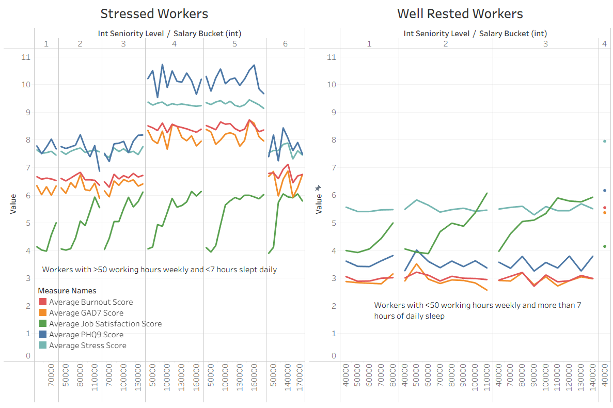
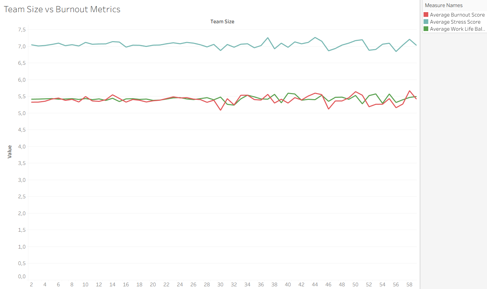
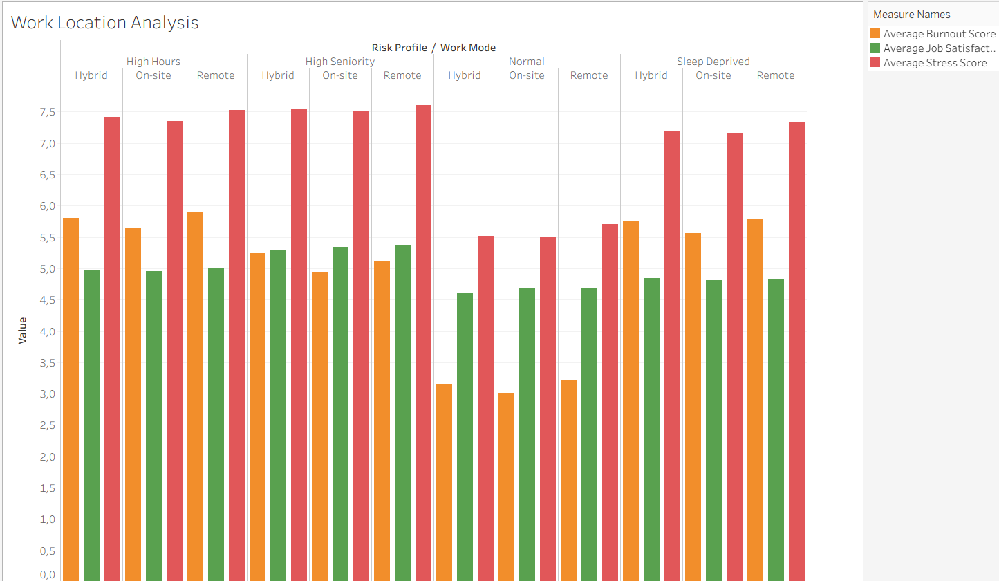
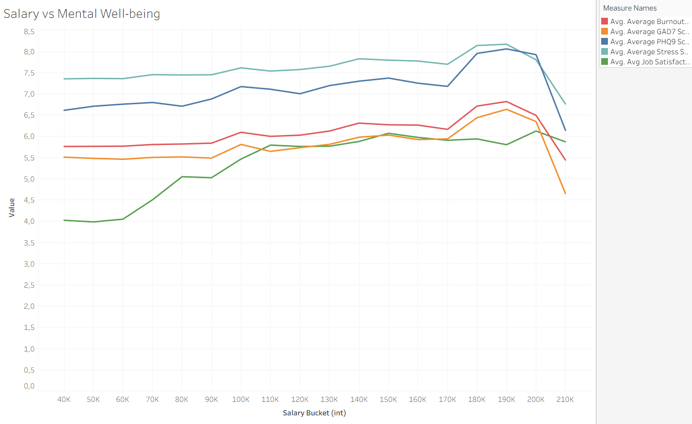
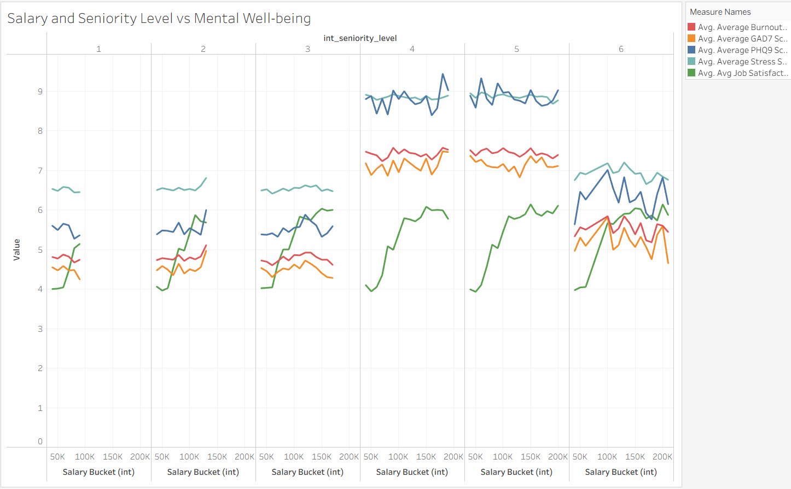
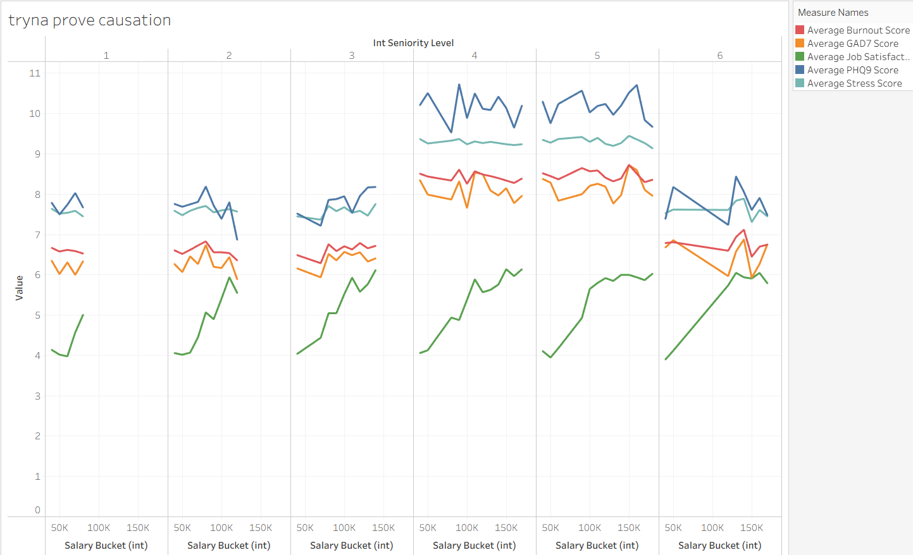
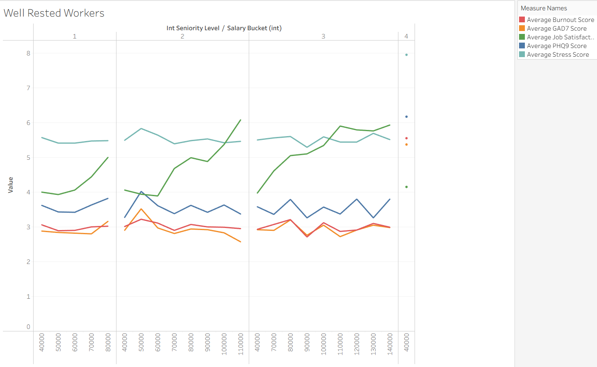

# Mental Health Analysis

## Core Project Questions

1. Is there a tipping point where a higher salary no longer correlates with higher job satisfaction and lower physiological distress, and what factors contribute to that plateau's existence?

    Hypothesis: Yes, higher salaries tend to mean more responsibilities, and that eventually cancels out the satisfaction gained from having higher financial compensation, which in turn also worsens their mental health.

    Status: It is somewhat true, as there is a general plateau regarding job satisfaction of $110k, regardless of status.

    Findings also conclude that the combination of high weekly work hours and low daily sleep duration contribute to worsening mental health in every mental indicator relating to psychological distress. Consequently, roles that require higher amounts of responsibility will experience more of that, leading to declining mental health in the higher seniority levels.

    Interestingly, these psychological distress indicator scores stayed high regardless of salary. Conversely, employees with a seniority level of 1-3 have relatively stable overall mental health. This indicates that employees at this level are more usually well-rested than their senior counterparts.

    Another interesting insight I found in this graph, is that job satisfaction does not seem to be influenced by psychological distress scores, it still plateaus at $110k whether or not the distress scores were high or not.

    

    If you would want to see further proof, check the methodology section below in this README.

2. Does a bigger team size correlate with burnout-like metrics, such as stress levels and work-life balance, and if so why?

    Hypothesis: Larger company/team sizes correlates with lower work-life balance, as more mental bandwith is needed due to the complexity of organizing teams at a higher scale. This lower work-life balance then leads to higher stress and burnout levels.

    Status: False, larger company/team sizes do not correlate with work-life balance, stress, or burnout levels at all, indicating that it is an extremely weak predictor for burnout-like metrics.

    

3. Does the impact of work location on stress, burnout and job satisfaction vary significantly when accounting for weekly work hours, daily sleep duration, or the seniority level, and if so why?

    Hypothesis: Yes, as hyrbid, and especially workers tend to have more flexible lifestyles, and that typically means they are more likely to take care of themselves, meaning they will have lower psychological distress scores than ones working on-site.

    Status: False, there is no correlation between work location and stress, burnout nor job satisfaction regardless of weekly work hours, daily sleep duration and seniority level. The main cause of psychological distress is still considered to be low quality sleep and high work hours.

    However, the job satisfaction scores for employees with high seniority are still slightly higher than those in the normal group. This further proves the insight in question one, where while higher salaries do correlate with higher job satisfaction until a certain point, they do not help with the increasing psychological distress scores, as it climbs.

    

4. Are there any geographical regions or countries that have a higher correlation between the gap of employees having high clinical PHQ9 and/or GAD7 scores, and mental health support/therapy usage, and what factors might explain this disparity?

    Hypothesis: It will have a pattern, as the country's culture, and stigma related to mental health and therapy, will significantly impact the amount of people getting help.

## Key Insights

- Higher salaries correlate with lower overall mental health (includes PHQ9, GAD7, overall stress and burnout). This suggests that higher compensation and financial incentives do not offset the negative impacts (on mental health) regarding increased job responsibility.
- Job satisfaction plateaus at a score of around 5.8-6.0 at the $110k salary threshold. This suggests that companies should pivot to other startegies for higher earning roles.
- The combination of high weekly work hours and low daily sleep duration contribute to higher amounts of psychological distress. Employees with higher job seniority may suffer more from this as they have more responsibilities, which creates an environment for that combination to thrive.

## Recommendations

WIP: This is where I will give recommendations/pieces of advice for companies/employers regarding on their employee's mental health.

## Methodology

This section will discuss the methodology of the analysis, including the processes I used to find data, clean data, analyze and manipulate data, and how I conduct analysis to solve diagnostic questions.

### Finding the Dataset

The deep dive analysis I intended to conduct required a dataset with more structural complexity and variable density, so after looking at a few other sources (I-NAMHS survey and WHO health indicators), I consequently chose [this dataset I found on kaggle](https://www.kaggle.com/datasets/mohankrishnathalla/mental-health-and-burnout-in-tech-workers-2026). Although the data was synthetic, it contained 100,000 rows of data calibrated on **up-to-date peer-reviewed research** such as the **Burnout Index**, **WHO Activity Guidelines**, and the validated **PHQ-9** and **GAD-7** clinical instruments used in medical practice globally.

### Data Cleaning Process

I decided to use python's pandas library to facilitate the cleaning process. This is to ensure reproducibility, better progress documentation and version control by using Git.

To start the process, I started by initializing my Git and GitHub repository, setting up the uv package manager, mypy, ruff and of course, pandas. However, I soon realized that jupyter notebooks would be better for prototyping than winging the full script, as it allows for scrollable results and being able to more effectively spot mistakes. Consequently, I decided to switch over to jupyter files and merge it into single python script once I was done.

During the data cleaning process, I:

- Identified and filtered out all the useless columns, as they were just useless data I wouldn't need to use.
- Validated the dataset by checking for inconsistent or null values by looping over each column's unique values, turns out there were none.
- Used `df.duplicated().sum()` to identify any duplicates, turns out there were none.
- Used `pd.to_numeric()` to save some memory on some columns, and also transforming the binary columns into True/False (boolean) values.

While the memory savings I tried to conduct is marginal at this scale (100k rows), I believe it is still good practice to do so.

### Data Analysis

For this job, I decided to use SQL because the queries are reproducable, self-documenting, and it helps with maintaining a more transparent audit trail on my iterations of the data transformations.

To start the process, I imported the data to bigquery as a table in my mental-health-analysis dataset, then I used DBeaver to connect to bigquery, and to write and save sql queries locally from there.

### The First Question

The first thing I notice is that this question already assumes that a higher salary correlates with higher job satisfaction and lower psychological distress by default, so I decided to validate that by creating my own SQL query to find correlation.

I first grouped/bucketed the salary to $10,000 increments, this was to reduce noise in the data and easily visualize patterns, then I also selected `job_satisfaction_score`, and all four main indicators of psychological distress: `burnout_score`, `stress_score`, `phq9_score` and `gad7_score`. This was to see how some of these would correlate to salary and job satisfaction.

These were the results when I exported it to a data visualization tool like tableau.

As you can see, a higher salary does correlate with a higher job satisfaction score up until about the 110k bracket, where it plateaus. However, unexpectedly, with a higher salary, all the indicators relating to psychological distress increase, atleast slightly.

Therefore, a higher salary does correlate with higher job satisfaction until a certain point ($110k), however it does correlate negatively with your overall mental health.

Having validated the question, the next logical step would be to try and prove the hypothesis.

Since there was no such thing as a responsibility_score column in the dataset, so my first idea was to use z-scores for columns deadline_pressure_score, meetings_per_day and work_hours_per_week to try get a responsibility index score, to estimate and mimic a real responsibility_score column.

However, when I tested out the columns to see if they were correlated using `CORR()` it turns out they all have almost 0 correlation with each other.

So, I will instead be using the seniority_level of these employees as a proxy for responsibility, as a higher seniority_level almost always means more responsibilities.

With this I noticed two distinct trends from the visualization:

    - There was a noticable jump between the pscyhological distress metric scores between seniority level 1-3 and seniority level 4-5. Employees with lower seniority levels have more stable mental health, and it could be potentially caused by the lower amount of responsibility it requires.

    -  The psychological distress metrics in seniority levels 4-5 remained quite consistently high despite having higher salaries. Interestingly, despite that, the job satisfaction scores in those levels kept rising until $150k, in which it plateaus.

While the data proves a strong correlation between responsibility and overall psychological distress metrics, it still does not prove causation, so that will be the final step to fully test our first hypothesis.

To start, I modified the main query to only select emmployees who had less than 7 hours of daily sleep duration and more than 50 hours of weekly worktime.

And I noticed the results, were almost identical, with the exception of a slight increase in some indicator scores.

To double check, I went ahead and modified that previous script, to show individuals with the opposite of what I said before (more than 7 hours of sleep, and less than 50 hours of weekly worktime). This was to ensure that even employees taking relatively good care of themselves might still suffer from drastic effeccts due to the amount of responsibility required for those roles.

Interestingly though, when I ran the query, there were almost no results regarding that when checking for employees with higher seniority. However, employees with lower senoirity levels did see lower psychological mental distress scores.

So safe to say, it is actually the combination of less daily sleep hours and more weekly work hours that create psychological distress in tech workers alike, and the seniority of their roles and the amount of responsibility required is not the cause, however it just supports those exact conditions.

### The Second Question

First, I tried to find the correlation between team size and those burnout metrics via SQL query.
After I wrote that, I imported it into tableau to get a nice line-graph visualization of it.

Turns out, there is zero correlation, which means the hypothesis is false and team size is not a valid indicator of burnout and work life balance.

### The Third Question

Again, I wrote a SQL query to try and select the correct data and find insights related to the question.

However, accounting for multiple variables at once in a single query was something I did not prepare for.

I first thought of making three seperate queries, accounting for each variable. However, I realized that it would be hard to join those results later on, and consequently it would be hard to then make meaningful data insights.

But then, I thought of using a `CASE` statement to group and aggregate the employees into four different brackets: 'High Seniority', 'High Hours', 'Sleep Deprived', and 'Normal'.

I thought this was better than the first one, as it joins all the data together into one SQL query, and I can export the query's results into one unified .csv file for visualization in tabelau, rather than joining three other csv files.

I then exported this data to tabelau, made it into four seperate bar charts (not line charts because ...), and grouped them by color to make them easily differentiable.

yeah so as you can see there no correlation, so this question is done.

## Technical Challenges

pass
since this only has maximum 100k rows

## Future Work

pass
